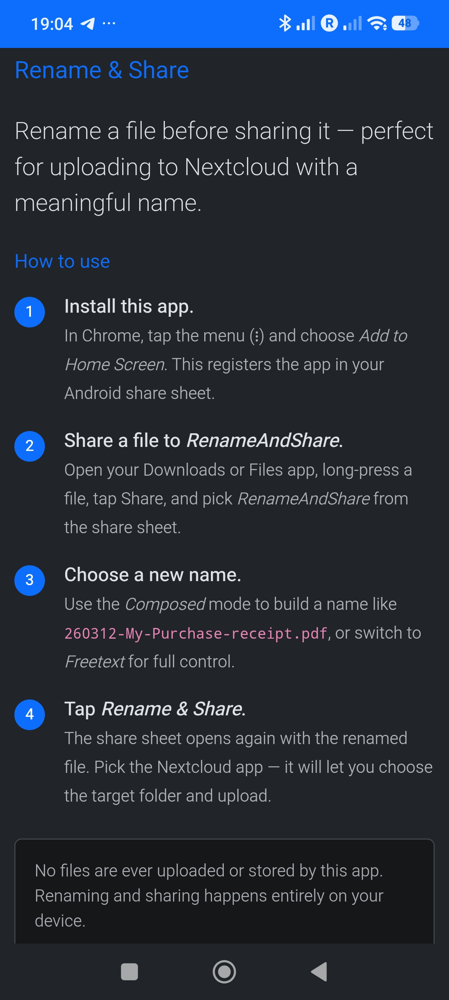
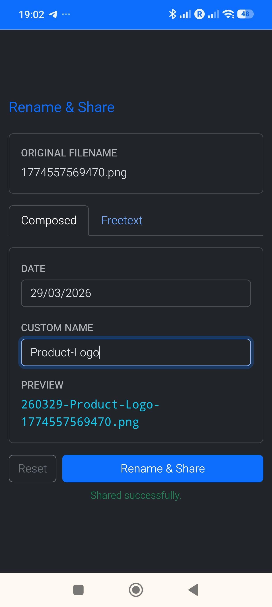
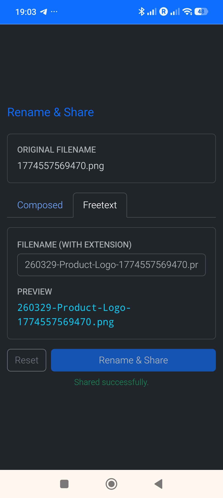

# Rename & Share

**https://moonline.github.io/Webapp.RenameAndShare/**

A minimal Progressive Web App (PWA) that acts as a rename proxy in your Android share sheet. Share a file to this app, give it a new name, and share it onward — for example to Nextcloud.

No files leave your device. Renaming happens entirely in the browser.

## Why

Mobile apps like Nextcloud do not allow renaming a file during upload. The typical workaround — rename in Files, then share — requires two separate steps in two different apps. Rename & Share collapses that into a single share-sheet flow.

**Flow:**


## Screenshots

<table>
  <tr>
    <td align="center"><br><sub>Info screen</sub></td>
    <td align="center"><br><sub>Composed filename mode</sub></td>
    <td align="center"><br><sub>Freetext filename mode</sub></td>
  </tr>
</table>

## Naming modes

**Composed** — builds a structured name from three parts:

```
{YYMMDD}-{Custom name}-{Original filename}{.ext}
```

Example: `260312-Fancy-Webshop-Laptop-receipt-123456.pdf`

**Freetext** — a single free-form text field. Switching from Composed to Freetext copies the composed result into the field as an editable starting point, so you can refine it without retyping.

Both modes show a live preview of the resulting filename.

## Install on Android

The app must be installed as a PWA for it to appear in the Android share sheet.

1. Open **https://moonline.github.io/Webapp.RenameAndShare/** in **Chrome for Android**.
2. Tap the menu (⋮) in the top-right corner.
3. Choose **Add to Home Screen** and confirm.
4. Rename & Share now appears in the system share sheet.

## Use

1. Open your **Downloads** or **Files** app.
2. Long-press a file and tap **Share**.
3. Select **Rename & Share** from the share sheet.
4. Enter the new name and tap **Rename & Share**.
5. The share sheet opens again — select **Nextcloud** (or any other target).

## Languages

The UI is automatically displayed in the user's browser language. Supported languages: **English, German (Deutsch), Spanish (Español), Portuguese (Português)**. Falls back to English for any other language.

## Deploy

The app is a static site — serve the project root from any HTTPS host. No build step required.

The service worker (`service-worker.js`) must be served from the root path of the origin so it can intercept the `/share-target` POST route.

## License

GNU General Public License v3.0 — see [LICENSE](LICENSE).
